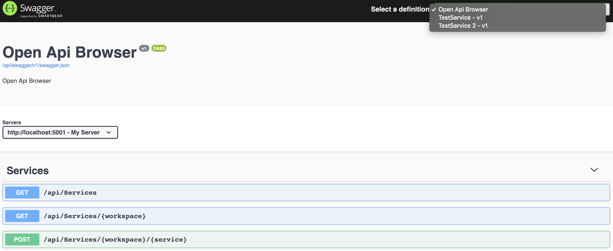

# open-api-browser

## How to use it?

Just implement your own version of the `OpenApiRepository` class.

## How it Works? 

Each one minute a BackgroundService updates your Open API list using the `OpenApiUpdater` class.

This interval can be changed in the `SwaggerExtensions` file in the `Api` project.

You can also define a prefix in which your Open API Solution should be deployed (for instance `api/swagger` instead of just `swagger`). This can be configured in your Startup.cs file.

